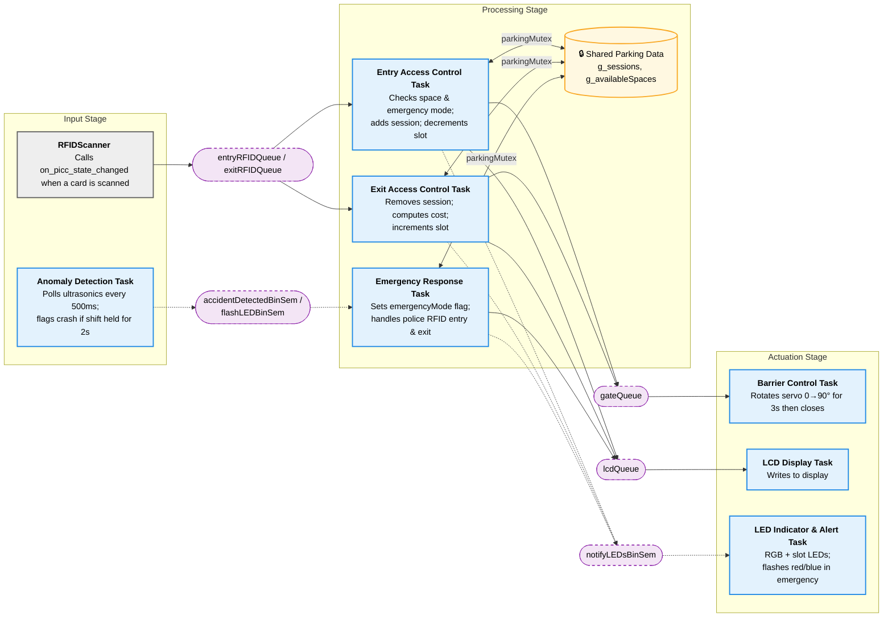
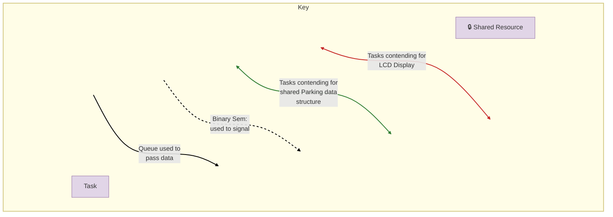

# Automated Parking System

## Group information
### Team members
- Adrish Danka 
- Arjunraj Sasikumar 
- Fadil Imran Pasha

## Project Description
Our project in an automated parking system with slot anomaly detection. It manages parking access, slot availability, 
duration logging and cost calculations, and anomaly detection within the slots. The system regulates access using RFID tags 
given to cars registered in the parking lot. Slot availability is also monitored through card taps and indicated through LEDs.
Duration logging and cost calculation is also done by keeping record of RFID taps. Emergency vehicles are issued a special
RFID card that grants them access even if the parking lot is full; normal cars are not allowed to enter if parking lot is full.

We also have an anomaly detction system implemneted using ultrasonic distance sensors. Any sudden movement is flagged and if the
state persists for a long time, we detect an anomaly and the parking lot is sealed. Normal cars cannot enter or leave until the emergency
is cleared. The RGB LED flashes and a message is displayed on LCD. Once normal distance is recorded or a police car arrives and handles
the emergency, normal operations are resumed.

This system can be scaled up and implemented in parking lots to reduce operation costs, increase user convienience, and serve as an alert
system for parking authorities in case an accident or mishap occurs in the lot.

## Video
https://github.com/user-attachments/assets/e85114d7-cd2f-41f3-8cbd-9ddf51b33fed

## System Diagram

## How it works
The task interaction diagram is shown below.

## Project Imapact
Our automated parking system addresses real world inefficiencies in traditional parking management by replacing manual operations with a fully automated, intelligent solution.

`Operational Cost Reduction` - By automating entry, exit, and slot monitoring, the system eliminates the need for on-site parking staffs, significantly cutting labor costs for parking facility operators.

`Improved User Convenience` - RFID based access allows registered vehicles to enter and exit quickly without stopping to interact with staff or ticketing machines. Real-time LED indicators let drivers instantly know slot availability, reducing time spent searching for a space.

`Automated Billing` - Duration logging and automatic cost calculation remove the need for manual fare collection, reducing human error and making the payment process seamless.

`Enhanced Safety and Emergency Response` - The anomaly detection system using ultrasonic sensors provides an added layer of security. By detecting sudden unusual movement and immediately sealing the lot, the system can contain a potential accident or security threat before it escalates. Authorities are alerted through visual and display indicators, enabling faster response.

`Priority Access for Emergency Vehicles` - The special RFID privilege for emergency vehicles ensures that ambulances and police cars are never blocked, even during a full lot or an active emergency, a critical feature in life threatening situations.

## FreeRTOS Implementation

The project uses FreeRTOS to divide the parking system into separate tasks. Each task handles one main part of the system, such as RFID access control, barrier movement, LCD messages, LED indicators, emergency handling, and ultrasonic anomaly detection. This makes the program easier to organize and allows different parts of the system to run independently.

The RFID scanner detects scanned cards and the scanned tag is then routed into either the entry RFID queue or the exit RFID queue depending on whether the vehicle is already inside the parking lot.

### Tasks

| Task Name | Priority | Description | Timing / Constraint |
|---|---|---|---|
| `vLCDDisplayTask` | 3 | Receives LCD messages from `lcdQueue` and displays them on the LCD. Messages are formatted into two lines. | Waits until a new LCD message is received, then updates the display. |
| `vLEDIndicatorTask` | 3 | Controls the normal parking LEDs and RGB LED. In normal mode, LEDs show available spaces. In emergency mode, the RGB LED flashes red and blue. | Updates when `notifyLEDsBinSem` is given, and flashes periodically during emergency mode. |
| `vEmergencyResponseTask` | 6 | Handles the emergency/anomaly state. It waits for `accidentDetectedBinSem`, sets emergency mode, displays an emergency LCD message, blocks normal access, and clears emergency mode when the anomaly stops. It also handles the emergency/police RFID behavior. | Highest priority task because emergency handling should override normal parking operation. |
| `vEntryAccessControlTask` | 5 | Handles RFID-based entry. It checks the tag type, whether the car is already inside, whether the lot is full, and whether emergency mode is active. If entry is allowed, it adds a parking session, decreases available spaces for normal cars, sends a barrier command, updates the LCD, and notifies the LED task. | Should respond quickly after a valid entry RFID scan. |
| `vExitAccessControlTask` | 5 | Handles RFID-based exit. It checks whether the scanned tag belongs to a vehicle currently inside the parking lot. If exit is allowed, it removes the parking session, increases available spaces for normal cars, sends a barrier command, and updates the LCD. The duration logging and cost calculation are also handled inside this task using the stored entry tick. | Should respond quickly after an exit RFID scan and update parking availability immediately. |
| `vBarrierControlTask` | 4 | Controls the servo barrier. It receives commands from `gateQueue`, opens the barrier using the servo motor, keeps it open briefly, and then closes it again. | Opens the barrier for about 3 seconds, then closes it and waits briefly before releasing control. |
| `AnomalyDetectionTask` | 7 | Reads the ultrasonic sensors and checks for sudden distance changes in the parking slots. If abnormal movement remains for the required time, it signals an accident/anomaly using semaphores. | Runs periodically, with sensor checks approximately every 500 ms. An anomaly is confirmed only if the sudden movement persists for the defined time. |

### Task Communication and Synchronization

The system uses FreeRTOS queues to pass events or commands between tasks. It uses semaphores to signal events, and mutexes to protect shared resources such as the LCD, barrier, and parking data.

| FreeRTOS Object | Type | Purpose |
|---|---|---|
| `entryRFIDQueue` | Queue | Stores RFID tag IDs that should be handled by the entry access-control task. |
| `exitRFIDQueue` | Queue | Stores RFID tag IDs that should be handled by the exit access-control task. |
| `gateQueue` | Queue | Sends gate commands to the barrier task, such as opening the barrier. |
| `lcdQueue` | Queue | Sends LCD messages to the LCD display task. |
| `accidentDetectedBinSem` | Binary Semaphore | Signals the emergency response task that an anomaly or accident has been detected. |
| `flashLEDBinSem` | Binary Semaphore | Signals the LED task to flash the RGB LED during emergency/anomaly mode. |
| `notifyLEDsBinSem` | Binary Semaphore | Notifies the LED task to refresh the LED indicators after parking availability changes or after emergency mode clears. |
| `lcdMutex` | Mutex | Protects the LCD so that only one task writes to it at a time. |
| `parkingMutex` | Mutex | Protects shared parking data, including available spaces, active parking sessions, and emergency/police RFID state. |
| `barrierMutex` | Mutex | Protects the servo barrier so that only one gate operation happens at a time. |

During normal entry, the RFID reads the scanned tag and routes it to `entryRFIDQueue` if the vehicle is not already inside. The entry access task then checks the tag type, parking availability, and emergency state. If entry is allowed, it updates the parking session, sends an open-barrier command to `gateQueue`, sends a message to `lcdQueue`, and gives `notifyLEDsBinSem` so the LEDs can update.

During normal exit, the scanned tag is routed to `exitRFIDQueue`. The exit access task checks the stored parking session, calculates how long the car stayed using the saved entry tick, calculates the cost, removes the session, updates the available-space count, sends a barrier command, and updates the LCD.

During an anomaly, `AnomalyDetectionTask` detects abnormal ultrasonic readings and gives `accidentDetectedBinSem` and `flashLEDBinSem`. The emergency response task then sets emergency mode, blocks normal access, displays an emergency message on the LCD, and keeps the system in alert mode until the anomaly is cleared or handled.

## Screenshots
1. Initial Parking System State: when nothing happened.

2. One car allowed, thus using one parking lot.

3. Another car allowed, thus using both parking lot.

4. Anomaly detected state.

5. Police entry and exit during emergency mode.

6. Car trying to leave/enter during the emergency mode.

7. Normal mode after emergency mode.

8. Cars Exiting states.

